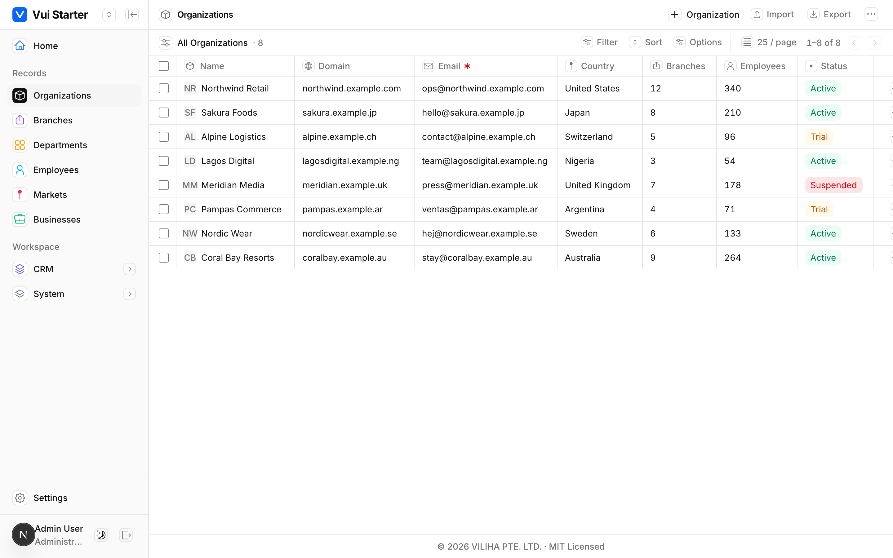
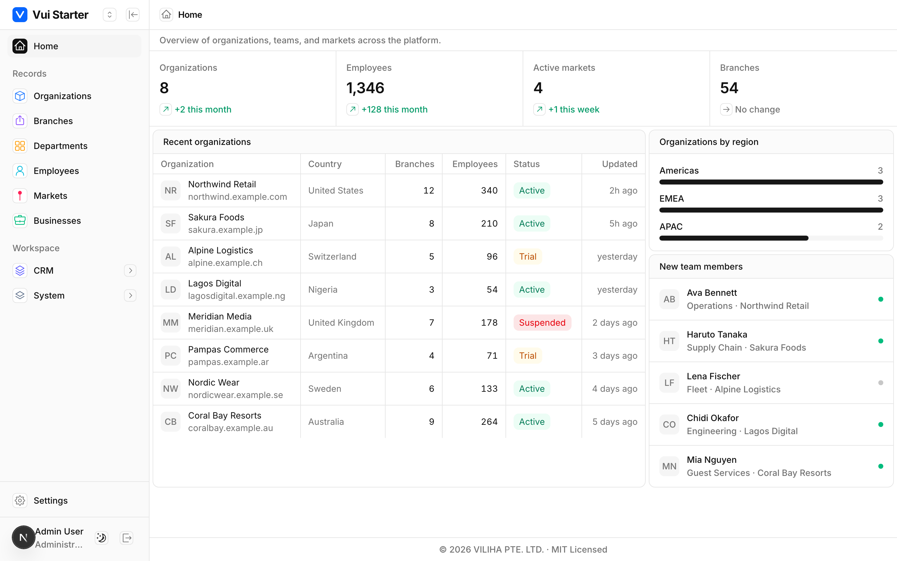

# Vui Starter

A free, **open-source admin/CRM design system** for React — a clean, token-driven
component library (**`@myviliha/vui-ui`**) plus a full-featured backoffice demo
you can clone and run.

Built on **Next.js · React 19 · Tailwind CSS v4 · shadcn-style components ·
Radix Icons**. Everything runs on in-memory mock data, so you can clone and run
with zero backend.

> This repo is both the **library** (`packages/ui`, published to npm as
> `@myviliha/vui-ui`) and a **reference app** (`apps/web/backoffice`) that shows
> every component in a real admin UI.





---

## Contents

- [Features](#features)
- [Quick start (clone the demo)](#quick-start-clone-the-demo)
- [Use the library in your project](#use-the-library-in-your-project)
  - [1 · New Next.js app](#1--new-nextjs-app)
  - [2 · New Vite + React app](#2--new-vite--react-app)
  - [3 · Existing project](#3--existing-project)
  - [4 · Turborepo / monorepo](#4--turborepo--monorepo)
- [Using components](#using-components)
- [Theming](#theming)
- [Components](#components)
- [Project structure](#project-structure)
- [Contributing](#contributing)
- [License](#license)

---

## Features

- **Design system in one stylesheet** — colors, typography, radius, dark mode,
  selection color and the icon treatment all live in `theme.css` as CSS
  variables. Restyle the whole app by editing tokens in one place.
- **RecordView datatable** — editable cells, resizable/auto-sizing columns,
  sticky header, sort/filter/column toggle, pagination, row actions
  (view/edit/delete), required-field markers, a buffered Add/Edit form panel,
  and **CSV / JSON / Excel / PDF import & export**.
- **App shell** — collapsible, colored-icon sidebar with nested groups; aligned
  page headers; light/dark theme.
- **Ships as TypeScript source** — no build step, tree-shakeable, and your app’s
  bundler compiles only what you import.

---

## Quick start (clone the demo)

Requires **Node 18+** and **pnpm 9+**.

```bash
git clone https://github.com/myviliha/vui-starter.git
cd vui-starter
pnpm install
pnpm dev          # starts all apps (backoffice, public, docs)
```

| App        | Path                          | Dev URL                 |
| ---------- | ----------------------------- | ----------------------- |
| Backoffice | `apps/web/backoffice`         | http://localhost:3001   |
| Public     | `apps/web/public`             | http://localhost:3000   |
| Docs       | `apps/docs/documentation`     | http://localhost:3002   |

Run a single app: `pnpm --filter backoffice dev`.

---

## Use the library in your project

Install the package and its peers:

```bash
npm install @myviliha/vui-ui           # or: pnpm add / yarn add / bun add
npm install -D tailwindcss @tailwindcss/postcss
```

`react` and `react-dom` are peer dependencies (use your app’s versions).
`@myviliha/vui-ui` ships **TypeScript source**, so your app’s bundler compiles
it — see the per-toolchain setup below.

### 1 · New Next.js app

```bash
npx create-next-app@latest my-app     # TypeScript + App Router
cd my-app
npm install @myviliha/vui-ui
```

**a. Tailwind v4** — in your global stylesheet (e.g. `app/globals.css`):

```css
@import "tailwindcss";
/* Design tokens, @theme mapping, base reset, AND scanning of the library’s
   component classes — all in one import. */
@import "@myviliha/vui-ui/theme.css";
```

**b. Transpile the source package** — in `next.config.ts`:

```ts
import type { NextConfig } from "next";

const nextConfig: NextConfig = {
  transpilePackages: ["@myviliha/vui-ui"],
};

export default nextConfig;
```

That’s it — `import { Button } from "@myviliha/vui-ui/button"` and go.

### 2 · New Vite + React app

```bash
npm create vite@latest my-app -- --template react-ts
cd my-app
npm install @myviliha/vui-ui
npm install -D tailwindcss @tailwindcss/vite
```

`vite.config.ts`:

```ts
import { defineConfig } from "vite";
import react from "@vitejs/plugin-react";
import tailwindcss from "@tailwindcss/vite";

export default defineConfig({ plugins: [react(), tailwindcss()] });
```

`src/index.css`:

```css
@import "tailwindcss";
@import "@myviliha/vui-ui/theme.css";
```

Vite transpiles the package’s TypeScript automatically — no extra config.

### 3 · Existing project

1. `npm install @myviliha/vui-ui`
2. Make sure you’re on **Tailwind CSS v4**, then add
   `@import "@myviliha/vui-ui/theme.css";` after `@import "tailwindcss";`.
3. **Next.js:** add `transpilePackages: ["@myviliha/vui-ui"]`.
   **Vite:** nothing extra. **Other bundlers:** ensure `node_modules/@myviliha/vui-ui`
   is transpiled (e.g. include it in your Babel/SWC/ts-loader rule).
4. If you already define shadcn-style tokens (`--primary`, `--background`, …),
   `theme.css` will set them — remove your duplicates, or import it first and
   override after.

### 4 · Turborepo / monorepo

This is the package’s native pattern (it *is* a Turborepo). Add it to any app in
your workspace:

```jsonc
// apps/web/package.json
{
  "dependencies": {
    "@myviliha/vui-ui": "^0.1.0" // or "workspace:*" if vendored in your monorepo
  }
}
```

- Add `transpilePackages: ["@myviliha/vui-ui"]` to each Next.js app that uses it.
- Import `@myviliha/vui-ui/theme.css` once in each app’s global stylesheet.
- No build/`dts` step is required — the package is consumed as source
  (“Just-in-Time”), so Turborepo caches your app build, not a library build.

---

## Using components

```tsx
import { Button } from "@myviliha/vui-ui/button";
import { Badge } from "@myviliha/vui-ui/badge";
import { RecordView, type RecordField } from "@myviliha/vui-ui/record-view";

export function Example() {
  return (
    <div className="p-4">
      <Badge variant="success">Active</Badge>
      <Button variant="primary">Save</Button>
    </div>
  );
}
```

Each component is a separate entry point (`@myviliha/vui-ui/<name>`), so you only
pull in what you use.

---

## Theming

All design decisions live in **`@myviliha/vui-ui/theme.css`** as CSS variables:

```css
:root {
  --background: oklch(1 0 0);
  --foreground: oklch(0.177 0 0);   /* #101112 */
  --primary: oklch(0.205 0 0);
  --radius: 0.625rem;
  --selection: #266df0;
  --button-primary: #266df0;        /* Attio-style primary button */
  /* …neutral palette, chart + sidebar tokens, dark-mode overrides… */
}
```

To customize, either edit the tokens (when vendored) or **override them after the
import** in your own CSS:

```css
@import "tailwindcss";
@import "@myviliha/vui-ui/theme.css";

:root {
  --primary: oklch(0.55 0.2 260);   /* your brand */
  --radius: 0.5rem;
}
```

Dark mode: add the `dark` class to `<html>` (the tokens ship a `.dark` block).

---

## Components

`avatar` · `badge` · `button` · `card` · `checkbox` · `dropdown-menu` ·
`input` · `select` · `table` · `record-view` (the full datatable) · plus the
`utils` (`cn`) helper and the `theme.css` design tokens.

---

## Project structure

```
apps/
  web/
    backoffice/        # Admin demo — the design system in a real app (:3001)
    public/            # Public/marketing demo (:3000)
  docs/
    documentation/     # Docs app (:3002)
packages/
  ui/                  # @myviliha/vui-ui — the published component library
  eslint-config/       # Shared ESLint config
  typescript-config/   # Shared tsconfig
```

Stack: Next.js · React 19 · Tailwind CSS v4 · Radix Icons · TanStack Table ·
pnpm workspaces · Turborepo · TypeScript 5.9.

---

## Contributing

Contributions are welcome! See **[CONTRIBUTING.md](./CONTRIBUTING.md)** for dev
setup, coding standards, and the PR flow, and
**[CODE_OF_CONDUCT.md](./CODE_OF_CONDUCT.md)**. All checks (lint, types, build,
security) run in CI on every PR.

```bash
pnpm install
pnpm dev            # run the apps
pnpm build          # build everything
pnpm lint           # zero-warning lint
pnpm check-types    # type-check
```

## License

[MIT](./LICENSE) © Suman Bonakurthi. Free for personal and commercial use.
