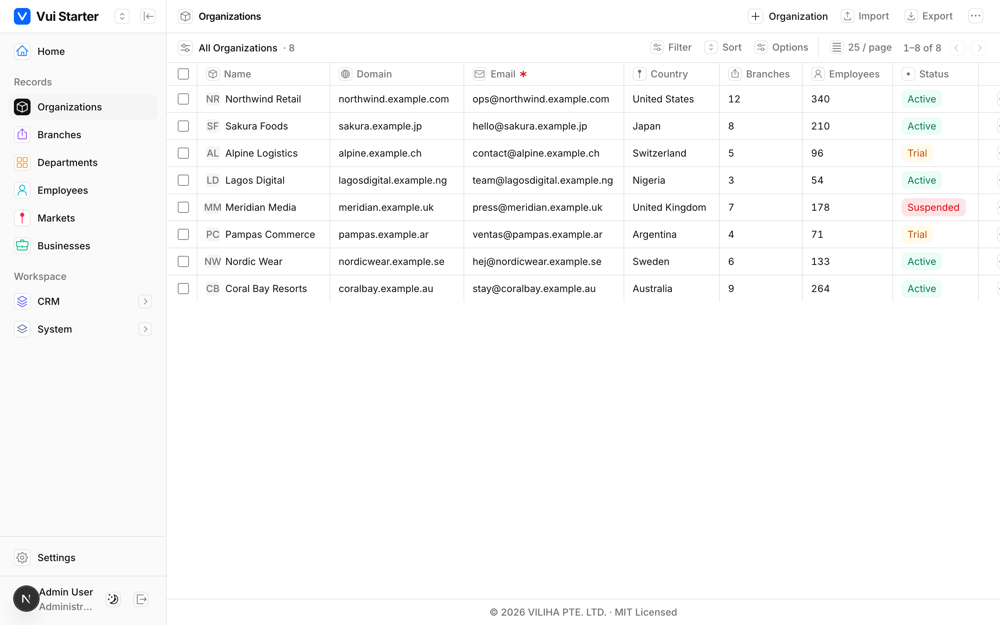
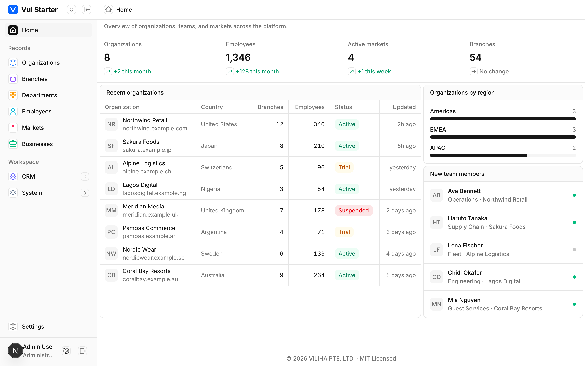

# Vui Starter

[](https://vui.viliha.com)
[](https://www.npmjs.com/package/@viliha/vui-ui)
[](./LICENSE)
[](https://github.com/sponsors/myviliha)

## ❤️ Sponsoring is what keeps Vui free

Vui is an enterprise-grade admin and SaaS theme, the kind of thing that's usually
sold, not given away. We keep it free under MIT, and sponsors are what make that
possible.

The components, tokens, datatable, auth screens, and docs all take real time to
build and keep in good shape. We give them away so you don't have to build or buy
your own. If Vui saved you time or helped you ship, the best thank-you is to
sponsor the project.

**Even $1 helps.** It goes toward new components, bug fixes, and keeping the docs
and demo current, and honestly it's what keeps us building in the open. If a
fraction of the people using Vui chipped in, that would be plenty.

> Sponsors get a spot on the wall (name and logo) and our genuine thanks.

### 👉 [Sponsor on GitHub →](https://github.com/sponsors/myviliha) &nbsp;·&nbsp; thank you 🙏

---

**Vui Starter** is a free, open-source **admin dashboard template** and **CRM
design system** for **React** and **Next.js**. It pairs a clean, token-driven
component library (**`@viliha/vui-ui`**) with a full backoffice demo you can
clone and run in minutes.

It's built on **Next.js, React 19, Tailwind CSS v4, shadcn/ui components, and
Radix**, and everything runs on in-memory mock data. Clone it and you have a
working admin UI (datatables, forms, charts, auth, dark mode) with no backend to
stand up.

> This repo is both the **library** (`packages/ui`, published to npm as
> `@viliha/vui-ui`) and a **reference app** (`apps/backoffice`) that shows
> every component in a real admin UI.





---

## What is free and what is Pro

**Everything in this repository is free and MIT, including the datatable.** That
is not a trial and it does not expire: every version already published is MIT
permanently, so nothing listed as free can move behind a paywall later.

| Area | Free | Pro (planned, not built yet) |
| --- | --- | --- |
| **Theme** | Design tokens, dark mode, the z-scale, runtime theming, per-tenant brand, motion and icon tokens | — |
| **Layout** | App shell (sidebar, top bar, open tabs), all five page types, auth and legal screens, command palette, global search | — |
| **Components** | Every React component including `RecordView`, the Vue package, charts in both Recharts and TanStack | Datatable and record forms for Vue and Svelte; premium blocks (billing, roles and permissions, audit log, inbox) |
| **Data** | Import and export (CSV, JSON, Excel, print), the mock API and controller pattern | — |
| **Tooling** | The `init` scaffolder, the MCP server, ten requirement templates | — |
| **Support** | Issues and discussions, in the open | Priority support and a commercial licence |

Pro is optional and additive: net-new work that does not exist yet. The full
breakdown is at [vui.viliha.com/docs/free-and-pro](https://vui.viliha.com/docs/free-and-pro/),
and the tiers are at [/pricing](https://vui.viliha.com/pricing/).

## Contents

- [Features](#features)
- [Quick start (clone the demo)](#quick-start-clone-the-demo)
- [Use the library in your project](#use-the-library-in-your-project)
  - [1 · New Next.js app](#1--new-nextjs-app)
  - [2 · New Vite + React app](#2--new-vite--react-app)
  - [3 · Existing project](#3--existing-project)
  - [4 · Turborepo / monorepo](#4--turborepo--monorepo)
- [Using components](#using-components)
- [Theming](#theming)
- [Configuration](#configuration)
- [Components](#components)
- [Project structure](#project-structure)
- [Contributing](#contributing)
- [License](#license)

---

## Features

- **A design system in one stylesheet:** colors, typography, radius, dark mode,
  selection color, and the icon treatment all live in `theme.css` as CSS
  variables. Restyle the entire app by editing tokens in one place.
- **The RecordView datatable:** editable cells, auto-sizing columns (with opt-in
  resize), a sticky header, sort/filter/column toggle, pagination, row actions
  (view/edit/delete), required-field markers, a buffered Add/Edit form panel, and
  **CSV / JSON / Excel / PDF import and export**.
- **Themed charts:** area, bar, line, and donut charts built on
  [Recharts](https://recharts.org) and driven by the `--chart-*` tokens, so they
  track your theme and dark mode without any per-chart styling.
- **Drop-in shadcn/ui:** around 35 unmodified shadcn components pick up the theme
  automatically because they read the same tokens. See them live at `/components`,
  alongside a fully validated shadcn Form (React Hook Form + Zod, every field
  type) at `/forms`.
- **A complete app shell:** a collapsible, colored-icon sidebar with nested
  groups, aligned page headers, a ⌘K command palette (Quick actions) and ⌘⌥K
  global search, a **browser-style open-tabs strip** (⌘-click a nav item to open
  one), and a light/dark theme toggle.
- **Configured, and still yours to change:** the theme ships finished and nothing
  in it is locked. `vuiPreset` is the shipped behaviour as a plain value, so the
  footer buttons of a form, what a row click does, whether delete confirms and
  how long a saved row stays highlighted are all config, changeable app-wide, per
  screen, or by the person using the app from the Settings page.
- **Shipped as TypeScript source:** no build step, tree-shakeable, and your app's
  bundler compiles only what you import.
- **Ready for AI agents:** the package ships an agent guide (`AGENT.md`) and a
  copy-paste `CLAUDE.template.md`, so Claude Code, Cursor, and Copilot build *with*
  the design system (its tokens, `RecordView`, and layout) instead of reinventing
  it.

---

## Quick start (clone the demo)

Requires **Node 18+** and **pnpm 9+**.

```bash
git clone https://github.com/myviliha/vui-starter.git
cd vui-starter
pnpm install
pnpm dev          # http://localhost:3000
```

That runs a single Next.js app (`apps/backoffice`) on
**http://localhost:3000**, the admin UI together with the docs, served at
**`/docs`** and reachable from the docs icon in the top bar.

### Scaffold your own project from this template

To grab a fresh copy without the git history and start building:

```bash
npx degit myviliha/vui-starter my-app
cd my-app
pnpm install
pnpm dev
```

Or click **“Use this template”** on the GitHub repo to create your own copy.

> Only want the component library in an existing app? Install it from npm instead
> with `npm install @viliha/vui-ui`. See
> [Use the library in your project](#use-the-library-in-your-project).

---

## Use the library in your project

Install the package and its peers:

```bash
npm install @viliha/vui-ui           # or: pnpm add / yarn add / bun add
npm install -D tailwindcss @tailwindcss/postcss
```

`react` and `react-dom` are peer dependencies, so your app's own versions are
used. Because `@viliha/vui-ui` ships **TypeScript source**, your app's bundler
compiles it. The per-toolchain setup is below.

### 1 · New Next.js app

```bash
npx create-next-app@latest my-app     # TypeScript + App Router
cd my-app
npm install @viliha/vui-ui
```

**a. Tailwind v4:** in your global stylesheet (e.g. `app/globals.css`):

```css
@import "tailwindcss";
/* Design tokens, @theme mapping, base reset, AND scanning of the library’s
   component classes, all in one import. */
@import "@viliha/vui-ui/theme.css";
```

**b. Transpile the source package:** in `next.config.ts`:

```ts
import type { NextConfig } from "next";

const nextConfig: NextConfig = {
  transpilePackages: ["@viliha/vui-ui"],
};

export default nextConfig;
```

That's all it takes: `import { Button } from "@viliha/vui-ui/button"` and go.

### 2 · New Vite + React app

```bash
npm create vite@latest my-app -- --template react-ts
cd my-app
npm install @viliha/vui-ui
npm install -D tailwindcss @tailwindcss/vite
```

`vite.config.ts`:

```ts
import { defineConfig } from "vite";
import react from "@vitejs/plugin-react";
import tailwindcss from "@tailwindcss/vite";

export default defineConfig({ plugins: [react(), tailwindcss()] });
```

`src/index.css`:

```css
@import "tailwindcss";
@import "@viliha/vui-ui/theme.css";
```

Vite transpiles the package's TypeScript automatically, with no extra config.

### 3 · Existing project

1. `npm install @viliha/vui-ui`
2. Make sure you’re on **Tailwind CSS v4**, then add
   `@import "@viliha/vui-ui/theme.css";` after `@import "tailwindcss";`.
3. **Next.js:** add `transpilePackages: ["@viliha/vui-ui"]`.
   **Vite:** nothing extra. **Other bundlers:** ensure `node_modules/@viliha/vui-ui`
   is transpiled (e.g. include it in your Babel/SWC/ts-loader rule).
4. If you already define shadcn-style tokens (`--primary`, `--background`, …),
   note that `theme.css` will set them too. Remove your duplicates, or import it
   first and override afterward.
5. **Using an AI agent?** Load the design rules so it builds *with* VUI instead of
   reinventing it:
   `cp node_modules/@viliha/vui-ui/CLAUDE.template.md ./CLAUDE.md`
   (or `./AGENTS.md`). That file `@`-imports the package's `AGENT.md` (the single
   source of truth), so you never copy the rules by hand.

### 4 · Turborepo / monorepo

This is the package's native pattern: the repo *is* a Turborepo. Add it to any
app in your workspace:

```jsonc
// apps/web/package.json
{
  "dependencies": {
    "@viliha/vui-ui": "^0.1.0" // or "workspace:*" if vendored in your monorepo
  }
}
```

- Add `transpilePackages: ["@viliha/vui-ui"]` to each Next.js app that uses it.
- Import `@viliha/vui-ui/theme.css` once in each app’s global stylesheet.
- No build or `dts` step is required. The package is consumed as source
  (“just-in-time”), so Turborepo caches your app build rather than a library build.

---

## Using components

```tsx
import { Button } from "@viliha/vui-ui/button";
import { Badge } from "@viliha/vui-ui/badge";
import { RecordView, type RecordField } from "@viliha/vui-ui/record-view";

export function Example() {
  return (
    <div className="p-4">
      <Badge variant="success">Active</Badge>
      <Button variant="primary">Save</Button>
    </div>
  );
}
```

Every component is its own entry point (`@viliha/vui-ui/<name>`), so you only pull
in what you actually use.

---

## Theming

All design decisions live in **`@viliha/vui-ui/theme.css`** as CSS variables:

```css
:root {
  --background: oklch(1 0 0);
  --foreground: oklch(0.177 0 0);   /* #101112 */
  --primary: oklch(0.205 0 0);
  --radius: 0.625rem;
  --selection: #266df0;
  --button-primary: #266df0;        /* brand primary button */
  /* …neutral palette, chart + sidebar tokens, dark-mode overrides… */
}
```

To customize, either edit the tokens directly (when vendored) or **override them
after the import** in your own CSS:

```css
@import "tailwindcss";
@import "@viliha/vui-ui/theme.css";

:root {
  --primary: oklch(0.55 0.2 260);   /* your brand */
  --radius: 0.5rem;
}
```

Dark mode: add the `dark` class to `<html>` (the tokens ship a `.dark` block).

---

## Configuration

The demo app's footer identity (company, year, license) is driven by environment
variables, so you can rebrand it without touching code. Copy
`apps/backoffice/.env.example` to `apps/backoffice/.env.local` and set any of:

```bash
NEXT_PUBLIC_COMPANY_NAME="Acme Inc."
NEXT_PUBLIC_COPYRIGHT_YEAR="2026"
NEXT_PUBLIC_LICENSE="All rights reserved"
# …or override the whole line at once (takes precedence over the three above):
NEXT_PUBLIC_FOOTER_NOTICE="© 2026 Acme Inc. · All rights reserved"
```

Each one is optional; anything left unset falls back to the default
`© 2026 VILIHA PTE. LTD. · MIT Licensed`. These are `NEXT_PUBLIC_` variables read
at **build time** and inlined into the export, so set them where your deploy runs
`pnpm build`. Setting them only at runtime won't take effect.

### Changing how the components behave

Env vars cover branding. Everything else is config, and it starts from what the
theme already ships:

```tsx
import { VuiProvider } from "@viliha/vui-ui/config";

<VuiProvider
  config={{ behaviour: { rowClick: "edit", confirmDiscardWhenDirty: true } }}
  userConfigurable={{ behaviour: ["rowClick", "flashMs", "confirmDelete"] }}
>
  {children}
</VuiProvider>;
```

`config` is yours as the developer. `userConfigurable` names the keys you are
willing to hand to whoever uses the app; those are saved per browser and edited
on the Settings page, which is how the demo's *Data tables* section works. Values
resolve per-instance prop → user preference → your config → `vuiPreset` → package
default, and each layer overrides only the keys it mentions.

Colors, radius, spacing and typography are deliberately not in here. They stay in
`theme.css`, which is what keeps every screen looking like one product.

---

## Components

`avatar` · `badge` · `button` · `card` · `chart` (themed Recharts wrapper) ·
`checkbox` · `command-palette` (⌘K command menu) · `dialog` (sectioned modal) ·
`confirm-dialog` · `dropdown-menu` · `input` · `kbd` (key caps + `Shortcut`) ·
`menu` (bordered list) · `required-mark` (the `*` marker) · `select` · `table` ·
`record-view` (the full datatable) · `config` (`VuiProvider` + `vuiPreset`: the
shipped theme as a config you override key by key) · plus the `utils` (`cn`)
helper and the `theme.css` design tokens.

---

## Project structure

```
apps/
  backoffice/          # The app (:3000): admin UI + docs at /docs
packages/
  ui/                  # @viliha/vui-ui, the published component library
                       #   (ships AGENT.md + CLAUDE.template.md, the AI-agent guide)
  eslint-config/       # Shared ESLint config
  typescript-config/   # Shared tsconfig
```

Stack: Next.js · React 19 · Tailwind CSS v4 · Radix Icons · TanStack Table ·
pnpm workspaces · Turborepo · TypeScript 5.9.

---

## Contributing

Contributions are welcome. See **[CONTRIBUTING.md](./CONTRIBUTING.md)** for dev
setup, coding standards, and the PR flow, along with
**[CODE_OF_CONDUCT.md](./CODE_OF_CONDUCT.md)**. Every PR runs the full set of
checks (lint, types, build, and security) in CI.

```bash
pnpm install
pnpm dev            # run the apps
pnpm build          # build everything
pnpm lint           # zero-warning lint
pnpm check-types    # type-check
```

## License

[MIT](./LICENSE) © VILIHA PTE. LTD. Free for personal and commercial use.

The core stays MIT: the component library, the CLI, the demo app, the templates
and the docs. Every version already published is MIT permanently, so nothing that
is free today moves behind a paywall later. Teams who want more than that (premium
blocks, components for other frameworks, an invoice and someone to ask) can read
about [Pro](https://vui.viliha.com/pricing/), which is optional and additive.

---

Made with ♥ from Vietnam by the [Viliha Team](https://viliha.com).
